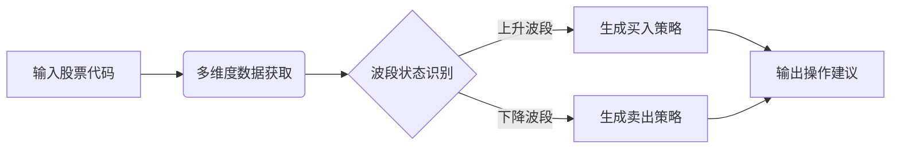
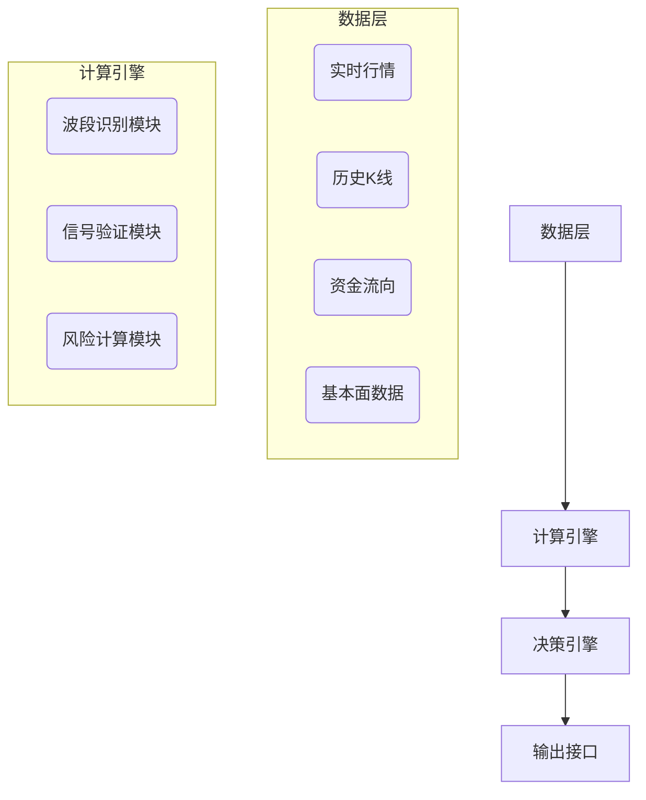

## 1. 文档概述
### 1.1 产品名称
智策波段交易助手（BandMaster Pro）

### 1.2 文档目标
定义基于波段交易的股票分析系统核心功能与技术方案

### 1.3 目标用户
- 短线交易者
- 波段操作投资者
- 量化交易初学者

### 1.4 核心价值
**三准原则**：
- 波段识别准（多周期协同）
- 买卖点位准（主力资金验证）
- 仓位控制准（动态风险管理）

## 2. 产品功能需求

### 2.1 核心分析流程


### 2.2 波段识别系统
#### 2.2.1 智能波段扫描
| 波段类型 | 周期范围   | 核心指标               |
|----------|------------|-----------------------|
| 微型波段 | 15-30分钟  | 5/15均线+量能突击     |
| 短线波段 | 1-3天      | 布林带收口+MACD金叉   |
| 标准波段 | 5-15天     | 20日均线斜率>30°      |
| 趋势波段 | 15-30天    | 60日EMA+ADX指标       |

#### 2.2.2 自适应参数调整
```python
def auto_adjust_parameters(volatility):
    # 根据市场波动率动态调整
    sensitivity = 0.7 if volatility < 0.02 else 0.9
    min_band_width = 0.015 if volatility < 0.03 else 0.03
    return sensitivity, min_band_width
```

### 2.3 买卖点决策引擎
#### 2.3.1 六维信号验证
1. **趋势方向**：20/60日均线多头排列
2. **动量强度**：RSI(14)在45-75区间
3. **量能配合**：成交量>5日均量120%
4. **资金验证**：主力资金连续3日净流入
5. **形态确认**：突破平台/回踩颈线
6. **市场环境**：板块强度排名前30%

#### 2.3.2 买卖点决策矩阵
| 信号组合强度 | 操作建议    | 仓位建议 | 持有周期 |
|--------------|------------|----------|----------|
| ≥5个信号     | 重仓买入   | 70%-80%  | 5-15天   |
| 3-4个信号    | 标准买入   | 40%-50%  | 3-7天    |
| 2个信号      | 轻仓试单   | 10%-20%  | 1-3天    |
| ≤1个信号     | 保持观望   | 0%       | -        |

### 2.4 仓位管理系统
#### 2.4.1 动态仓位分配


#### 2.4.2 智能止盈止损
| 策略类型   | 触发条件                    | 执行动作         |
|------------|----------------------------|------------------|
| 阶梯止盈   | 收益达15%/25%/40%           | 分批减持1/3仓位 |
| 移动止损   | 从高点回撤7%                | 清仓            |
| 时间止损   | 持有5日未达目标收益         | 减半仓          |
| 事件止损   | 突发利空/板块资金大幅流出   | 立即止损        |

### 2.5 可视化报告系统
#### 2.5.1 波段分析图例

*图示说明：*
- 绿色箭头：波段买点
- 红色箭头：波段卖点
- 蓝色阴影：主力资金流向
- 黄色虚线：动态止损线

#### 2.5.2 操作建议卡片
```
【波段操作信号卡】
股票：比亚迪(002594.SZ)  更新：2025-07-17 14:30
━━━━━━━━━━━━━━━━━━━━━━━━━━━━━
▶ 波段状态：上升中途(第5天/平均周期12天)
▶ 关键位置：
  支撑位：￥215.6（5日线）
  压力位：￥238.8（前高）
▶ 信号验证：
  ✅ 趋势方向：20/60日均线多头排列（强度78）
  ✅ 量能配合：今日量能达5日均量153%
  ✅ 资金验证：主力3日净流入8.2亿
  ✅ 形态确认：突破三角形整理
  ⚠️ 市场环境：新能源板块排名25/56
▶ 操作建议：
  🟢 现价(￥226.5)建仓50%
  🔵 回调至￥220加仓25%
  🎯 第一目标位：￥238（5.1%空间）
  ⛔ 跌破￥214止损（-5.5%）
▶ 风险提示：明日期权交割日，警惕盘中波动
```

## 3. 技术架构

### 3.1 系统架构图


### 3.2 核心算法清单
1. **波段顶点检测算法**（Peak-Valley Detection）
2. **多周期趋势共振算法**
3. **主力资金异动分析算法**
4. **动态仓位优化模型**

### 3.3 技术栈选择
| 模块   | 技术方案                  |
| ---- | --------------------- |
| 数据获取 | AkShare + Tushare Pro |
| 指标计算 | TA-Lib + Pandas       |
| 机器学习 | Scikit-learn（趋势分类）    |
| 实时计算 | Redis Stream          |
| 前端展示 | react + ECharts 5     |

## 4. 风险控制体系

### 4.1 系统级风控
| 风险类型     | 控制措施                  |
|--------------|--------------------------|
| 数据延迟     | 多源校验+数据新鲜度标记   |
| 模型失效     | 每日回测+波动率监测       |
| 极端行情     | 熔断机制（暂停建议输出）  |

### 4.2 交易风控规则
1. **单票风险限额**：
   ```python
   max_position = min(30, 总资金*0.1)  # 单股不超过总仓位的10%
   ```
2. **行业分散原则**：
   - 同行业持仓不超过总仓位25%
3. **黑名单过滤**：
   - ST/*ST股票
   - 5日振幅<3%的僵尸股
   - 北向资金持续流出的股票

### 4.3 免责保护机制
> 📌 **重要风险提示**：  
> 本系统分析结果基于历史数据与量化模型，不构成任何投资建议。  
> 使用者需独立承担投资决策风险，建议结合个人风险承受能力谨慎参考。

## 5. 实施计划

### 5.1 开发里程碑
| 阶段    | 时间窗     | 交付目标                     |
|---------|------------|----------------------------|
| MVP     | 第1-2周    | 核心波段识别引擎            |
| Alpha   | 第3-4周    | 买卖点决策系统+基础风控     |
| Beta    | 第5-6周    | 多周期协同+主力资金分析     |
| V1.0    | 第7-8周    | 全功能Web界面+移动适配      |

### 5.2 成功指标
| 指标项             | 目标值    | 测量方式               |
|--------------------|-----------|-----------------------|
| 波段识别准确率     | ≥78%      | 历史数据回测          |
| 信号生成延迟       | <300ms    | 生产环境压力测试      |
| 用户操作转化率     | >40%      | A/B测试（建议→交易）  |
| 极端行情存活率     | >90%      | 2015/2018/2020回测    |

## 6. 附录

### 6.1 术语表
- **ATR**：平均真实波幅（波动率指标）
- **ADX**：平均趋向指数（趋势强度）
- **主力资金**：单笔成交额>50万的资金流

### 6.2 参考数据源
1. 腾讯财经实时行情
2. 东方财富资金流向
3. Tushare Pro基本面数据
4. 新浪财经新闻舆情

---
**版本控制**  
V1.0 | 2025-07-17 | 初稿  
V1.1 | 2025-07-20 | 增加主力资金分析模块  